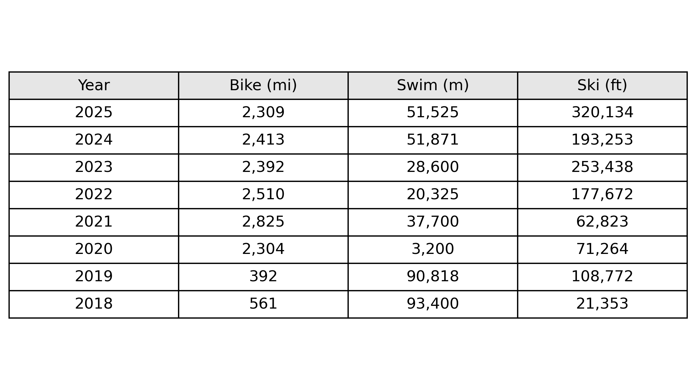
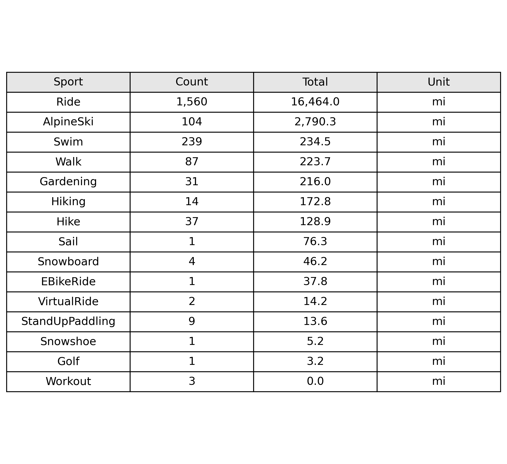
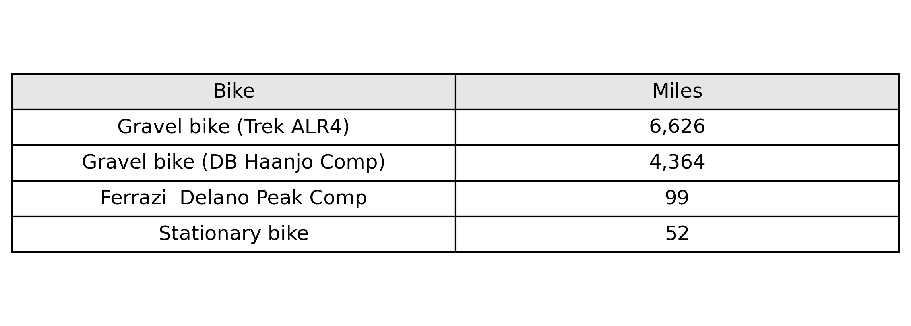

## What is this thing? 

Not sure, but I know my Strava 2025 wrapped did not provide many data views I was interested in. I also have strong opinions that "wrapped' packages should not be generated until January 1. Or at least let us paying customers generate a customized one when we want.

### What code are we writing? 

Will start with Streamlit for the app framework, and will separate the data getting, the data analysis,and the resulting publication concerns. 

Are there other frameworks to port to later? Rio? 

```
strava-stats/
├── data/                    # The "Local Data Store"
│   ├── raw/                 # Raw JSON/CSV from Strava (don't edit these)
│   ├── processed/           # Cleaned data ready for analysis
│   └── images/              # Generated static images (png/jpg)
│
├── src/                     # The stuff that knows how to do specific things
│   ├── __init__.py          # Makes this a generic Python package
│   ├── strava_client.py     # Connects to API, handles auth/refresh tokens
│   ├── processing.py        # Pandas logic: cleaning, aggregation, math
│   └── plotting.py          # Generates Figure objects or saves PNGs
│
├── app.py                   # The App! The UI, and process manager 
├── .env                     # Secrets (API Client ID, Secret) 
├── .gitignore               # Ignore .env, data/, and __pycache__
└── requirements.txt         # Dependencies
```

## Strava activity data

### Attributes of top interest

```json
{
    "2025": [
        {
            "resource_state": 2,
            "athlete": {
                "id": 2892263,
                "resource_state": 1
            },
            "name": "Lily dropped me off wander",
            "distance": 26215.8,
            "moving_time": 5587,
            "elapsed_time": 7636,
            "total_elevation_gain": 141.9,
            "type": "Ride",
            "sport_type": "Ride",
            "start_latlng": [
                40.116213,
                -105.162089
            ],
            "end_latlng": [
                40.200938,
                -105.143176
            ],
            "visibility": "followers_only",
          
            "id": 16897555700,
            "start_date": "2025-12-31T17:29:50Z",
            "start_date_local": "2025-12-31T10:29:50Z",
            "timezone": "(GMT-07:00) America/Denver",
            "utc_offset": -25200,

            "gear_id": "b9657721",
            "average_speed": 4.692,
            "max_speed": 12.2,
            "average_watts": 110.9,
            "kilojoules": 619.5,
            "elev_high": 1577.5,
            "elev_low": 1540.6,

            "total_photo_count": 5
        }
    ]
}
```

### Entire object

```json
{
    "2025": [
        {
            "resource_state": 2,
            "athlete": {
                "id": 2892263,
                "resource_state": 1
            },
            "name": "Lily dropped me off wander",
            "distance": 26215.8,
            "moving_time": 5587,
            "elapsed_time": 7636,
            "total_elevation_gain": 141.9,
            "type": "Ride",
            "sport_type": "Ride",
            "workout_type": null,
            "device_name": "Strava App",
            "id": 16897555700,
            "start_date": "2025-12-31T17:29:50Z",
            "start_date_local": "2025-12-31T10:29:50Z",
            "timezone": "(GMT-07:00) America/Denver",
            "utc_offset": -25200,
            "location_city": null,
            "location_state": null,
            "location_country": null,
            "achievement_count": 1,
            "kudos_count": 2,
            "comment_count": 0,
            "athlete_count": 1,
            "photo_count": 0,
            "map": {
                "id": "a16897555700",
                "summary_polyline": "iezsF`nz`SDZDfTCfDCPONwBF{d@UeXHGDAlDGj@HlA?nBGb@QTuH@iIOw@NKRCb@@bBExYDvDEhC?rEBzG?`@GN[HiAMyV?oLMsBPUNCRAxCDZNX@TGjFB`AA|\\GbADlA@tHJ`CCtBF^j@z@Vp@H^TdHElAe@rC[~Cg@`DBdECpBJ`Ar@bBfA~@FL?NAdAMrAq@dDq@vBOhADzCIlC?tBMtB@bBIrEBvBa@CSMWgB{@iEm@eCu@{DQSiAc@w@m@q@Pc@TeADOFGRTpE@rC\\hDERYJQIMSSuCa@qAWUcCyAmCPiBrA[\\M`@K~A[tAQtAI`Bq@zAUT]Da@QOWs@wCg@[mAIoBt@q@JcAg@cAAcAg@gBwAoAcBa@{@c@uAi@iASw@EcABkAD}@RyAHgE\\kCIcEJiAb@q@RG`ABxBNPOJe@?yDZgA@cAN}BG_CKgAEoCG}@BQCaAQaAFiCVk@Hk@AuEFmAGsBBiBGm@KQ[G}@DQU]gAoA]k@_@wCuCMWGm@HyBWoAFo@m@sB@]^YF_@Ca@Ym@Ge@?o@RaBQkCl@qAV}@PUv@AjATd@SRq@ZwBJWhAaAlASr@c@bAyCNOhDU`B`@p@]vAGzIBlBP`CKdCDnK?pAJPQJW@MIOmIHgTCqEOy^DsGEaCMeE@_@EeNV}IAoBIuEHseAOqh@?qDID@?PB?`B@PLN\\c@pOAnEGj@ShAWRi@@cCOUJKNIf@EbAF~KEfBM\\UTaAP]X[dAUlBS`@i@Ri@GuBJiGEc@JUnAFrGCVITYHiCD_D\\iAl@uAhAm@VeCX_Dx@uBBs@MIIcIEy@DSEAJL?AMWCK_@FuF?ik@DiHRgBlCsI\\oBU]{CDGEE_@?cwAHuf@CoBDyACoCCG@kA_@yBFm@IyABqECeAHoEGKk@@a@OoAIe@YYc@W\\q@@STOlADvAGJ[Cd@DBHEtCCh@[tBGxF[lBsAbFmBpGUlAa@hAw@vCKl@a@fAuA~E]`BIRGA@LI^W`@_@Vm@PgANi@RY@mAm@q@y@kBk@SUUaAF_DK_BJoBAKOOm@]mAc@qAu@YG_Bb@u@@u@Ke@Fo@fASt@]VqD@cAy@OYAYVwAE_@Ke@q@cBMkANsCFqD`@eGLk@HcBIoAQoAC_CDo@RaAn@mCjA{DBQXo@C[t@D?KCCQL[?EJXR|@?mA?II?QMSBc@lAkC",
                "resource_state": 2
            },
            "trainer": false,
            "commute": false,
            "manual": false,
            "private": false,
            "visibility": "followers_only",
            "flagged": false,
            "gear_id": "b9657721",
            "start_latlng": [
                40.116213,
                -105.162089
            ],
            "end_latlng": [
                40.200938,
                -105.143176
            ],
            "average_speed": 4.692,
            "max_speed": 12.2,
            "average_watts": 110.9,
            "device_watts": false,
            "kilojoules": 619.5,
            "has_heartrate": false,
            "heartrate_opt_out": false,
            "display_hide_heartrate_option": false,
            "elev_high": 1577.5,
            "elev_low": 1540.6,
            "upload_id": 17990150884,
            "upload_id_str": "17990150884",
            "external_id": "24EF41AA-0081-432F-A5B9-89E0DBE2861B-activity.fit",
            "from_accepted_tag": false,
            "pr_count": 0,
            "total_photo_count": 5,
            "has_kudoed": false
        }
    ]
}
```

## Example output

### Annual bike, ski, and swim distances



### Activity types



### Bike stats

