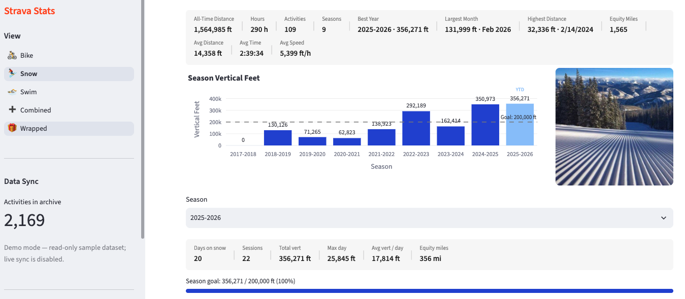
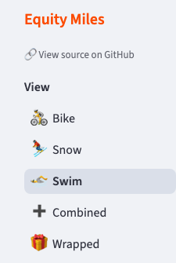
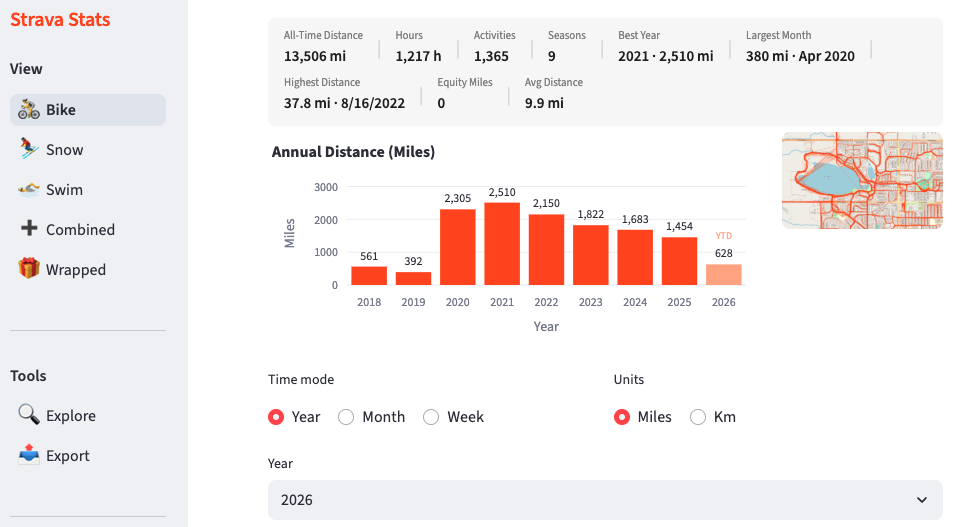
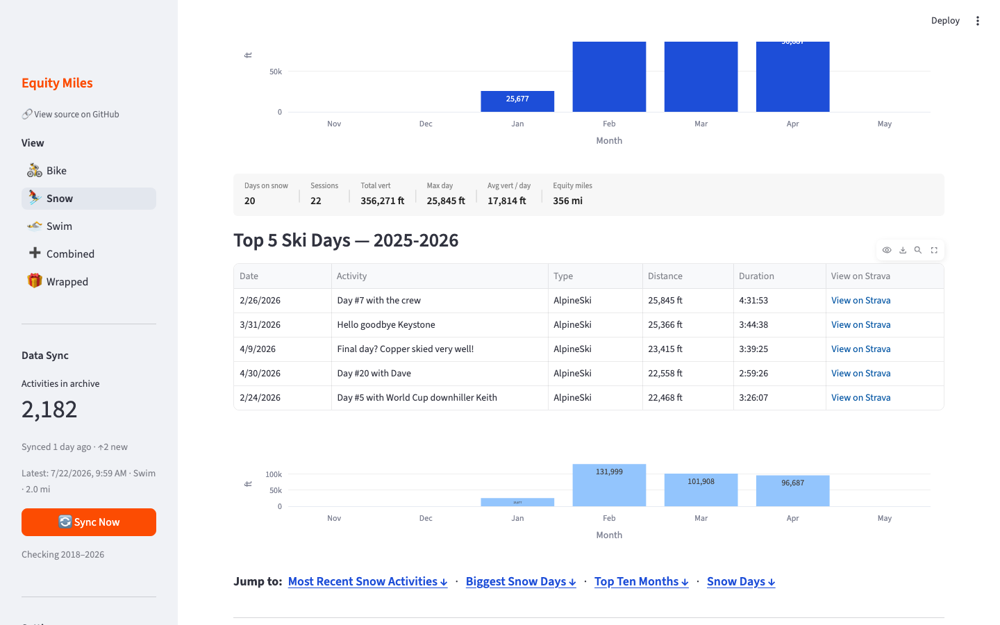
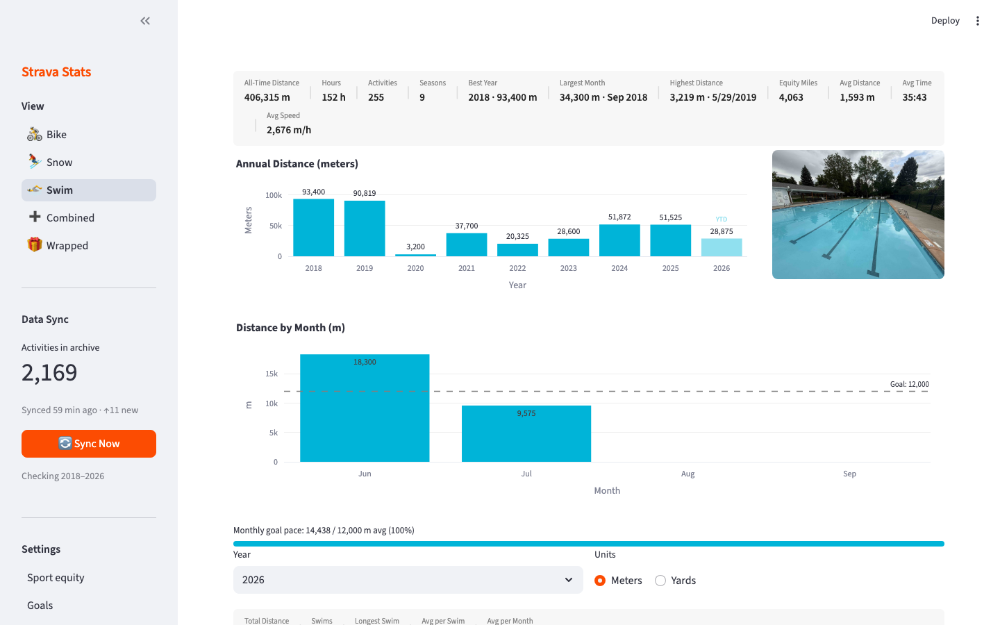
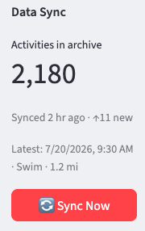

# Equity Miles

*A personal Strava dashboard for people who ride, ski, swim, run, and hike — and want one overall measurement for how their year is actually going.*

I bike. A lot. So most of my own sense of "how's this year going" naturally comes out in miles. But a week of skiing or swimming doesn't produce a mileage number that means anything next to a bike ride — and Strava's own "Wrapped" doesn't try to answer that. This app's whole reason for existing is one idea: **equity miles**, a common unit that converts every sport's effort into the currency of whichever sport you actually care about, so "was this a better year than last year?" has a real answer no matter which sports made up your training.

Everything else — the sport tabs, the year-over-year comparisons, the "Wrapped"-style summary — is really just a shell around that one number.

A sidebar-driven Streamlit app: **View** pages for Bike, Snow, Swim, Running, and Hiking (pick which ones show up in Settings), a Combined cross-sport equity view, and a Wrapped-style summary; **Tools** for full-text activity search and data export; and a **Settings** area split into five focused sub-pages. Data syncs directly from the Strava API and is stored locally — nothing leaves your machine.

**🚀 Live demo: [strava-stats-1.streamlit.app](https://strava-stats-1.streamlit.app/)** — a read-only build with a sanitized copy of the real dataset (see [How the demo works](#how-the-demo-works)). Works nicely on a phone too: open it in Safari and use Share → *Add to Home Screen*.

> **Not affiliated with, endorsed by, or sponsored by Strava.** This is an independent, unofficial project built against Strava's public API. "Strava" and the Strava logo are trademarks of Strava, Inc.



---

## User guide

### Multi-sport dashboard

The sidebar reads top-to-bottom: **View** (the five sport/summary pages), **Data Sync** (archive count, last-sync age, and the Sync Now button), **Settings**, and **Tools**.



Each entry swaps the entire main panel for that page — no page reload, since it's all one Streamlit app. The screenshot at the top of this page is the **Snow** view, opened straight from that sidebar.

### Sport summaries

Every sport view opens the same way: an all-time stats line, a full-width overview chart, a distance-by-month chart for the selected year, period/unit controls, and ranked tables for the selected period.

**Bike** — all-time stats; a "top bikes" ranking by lifetime miles; an annual distance chart paired with a route-heatmap thumbnail; an all-time "which months do I ride" chart; Year/Month/Week breakdowns; ranked tables for recent rides, longest rides, and top months; a gear filter; and the full interactive route heatmap at the bottom.



**Snow** — all-time stats in vertical feet; a season-by-season overview chart; a season detail view with goal progress and a vert-by-month chart; ranked tables for recent days, biggest days, and top months; and a full season log.



**Swim** — all-time stats; a multi-year overview chart; a Year/Units-controlled monthly breakdown with goal-pace tracking; and ranked tables for recent and longest swims.



### Live data sync

The sidebar shows the total archive count, how long ago the last sync ran, and a one-line summary of the most recent logged activity (date/time, sport, distance). Click **Sync Now** to pull new activities from Strava without leaving the browser — it runs an incremental fetch, clears the data cache, and reloads automatically so every chart reflects the new data immediately.

Past years are fetched once and archived. Only the current year is re-checked on each sync, so a sync stays fast no matter how much history is in the archive.



### Equity miles

Different sports aren't directly comparable by distance, so this dashboard normalizes everything to a common "bike mile" unit:

| Sport | Default conversion |
|---|---|
| Bike | 1 mile = 1 equity mile (reference) |
| Swim | 100 meters = 1 equity mile |
| Ski  | 1,000 vertical feet = 1 equity mile |

The **Combined** tab stacks equity miles by sport for each year so you can see total fitness output regardless of which sports you focused on. Conversion rates are configurable in the Settings tab.


Activities with equity markers in their name (`SEq`, `HEq`, `GEq`, etc.) are manual equity declarations — they're listed separately and excluded from calculated totals to avoid double-counting.

### Other tabs

**Wrapped** — pick any rolling window (last 365 days, last 30 days, a specific year or month) and a sport filter to get a period-in-review summary with charts and sport breakdown.

**Explore** — full-text search across all activities with date-range and sport-type filters. Results table with CSV download.

**Export** — annual summaries, monthly breakdowns, and a full activity table, each with PNG download and a combined ZIP.

**Settings** — five focused sub-pages: **Sport equity** (conversion rates and the reference sport), **Goals** (annual/monthly/seasonal targets), **Seasons** (ski and swim season boundaries), **Map** (heatmap home location), and **Appearance** (theme, tab images). Each sub-page saves independently, merging its slice into `data/settings.json`.

---

## Developer documentation

This repository contains the code and content needed to deploy your own Equity Miles app. This app was built as a Streamlit service.

### Quick start

```bash
# 1. Clone and install
git clone https://github.com/jimmoffitt/strava-stats.git
cd strava-stats
pip install -r requirements.txt

# 2. Add your Strava credentials
echo "STRAVA_CLIENT_ID=your_id" >> .local.env
echo "STRAVA_CLIENT_SECRET=your_secret" >> .local.env

# 3. Complete the Strava OAuth flow once to get a token
#    See: https://developers.strava.com/docs/getting-started/
#    The token file lives at data/strava_tokens.json

# 4. Fetch your activity history
python run_pipeline.py

# 5. Launch the dashboard
streamlit run app.py
```

After the first run, use the **Sync Now** button in the sidebar for incremental updates.

---

### How the demo works

The [live demo](https://strava-stats-1.streamlit.app/) is the same app in a read-only **demo mode**, deployed on [Streamlit Community Cloud](https://share.streamlit.io) with no credentials on the host.

**Sanitized dataset.** The real activity archive is gitignored (it contains heart rate, power, device, and precise location data). `make_demo_data.py` derives a committable copy at `data/demo/activities.json` by whitelisting only the ~14 fields the app actually reads — id, name, type, dates, distance, times, elevation, gear id, and a couple of counts — plus each ride's `map.summary_polyline`, kept by choice so the bike heatmap renders with real routes in the demo. Exact start/end coordinates, heart rate, power, device names, and location strings are all dropped. A copy of the gear map rides along so bike names render.

**Automatic demo mode.** `DEMO_MODE` in `src/config.py` turns on when `STRAVA_STATS_DEMO=1` is set, or automatically when the real archive is absent but the demo dataset is present — which is exactly the state of a fresh clone, since `data/` is gitignored. In demo mode every data path is redirected to `data/demo/`, the Sync Now button is replaced with a read-only notice, and runtime writes (settings, sync records) land in `data/demo/` where they're gitignored. Locally, with the real archive present, nothing changes.

**Deployment.** Point [share.streamlit.io](https://share.streamlit.io) at `app.py` on `main` — that's the whole setup. A fresh clone has no real archive, so demo mode enables itself; no secrets or environment configuration are needed. The app redeploys automatically on every push. Two host-friendly details: `requirements.txt` lists direct dependencies with loose version ranges (so the host's Python always gets prebuilt wheels), and the Export tab probes for PNG-rendering capability at runtime, degrading to CSV-only downloads where kaleido has no Chrome to drive.

**Refreshing the demo data.** After a sync, rerun `python make_demo_data.py`, review the printed field/name summary, and commit the updated `data/demo/activities.json`.

---

### How it's built

#### Stack

| Package | Role |
|---|---|
| [Streamlit](https://streamlit.io) | Dashboard framework and UI |
| [Plotly](https://plotly.com/python/) | Interactive charts |
| [pandas](https://pandas.pydata.org) | Data processing and aggregation |
| [python-dotenv](https://github.com/theskumar/python-dotenv) | Credentials from `.local.env` |
| [requests](https://docs.python-requests.org) | Strava API calls and token refresh |
| [kaleido](https://github.com/plotly/Kaleido) | Static PNG export (Export tab) |

#### Project structure

```
strava-stats/
├── app.py                   # Streamlit dashboard — all page render functions
├── run_pipeline.py          # CLI: fetch → process → publish (static PNGs)
├── make_demo_data.py        # Builds the sanitized data/demo/ dataset for the demo
├── gen_screenshots.py       # Regenerates the chart PNGs embedded in this README
│
├── src/
│   ├── config.py            # Env vars, file paths, sport type constants, DEMO_MODE
│   ├── fetch_data.py        # Strava OAuth, token refresh, incremental archive sync
│   ├── process_data.py      # pandas aggregations: by year, season, month, week
│   ├── charts.py            # Plotly figure factories (one function per chart type)
│   └── publish_data.py      # Matplotlib figure factories (legacy static pipeline)
│
└── data/                    # Local data — not committed to git, except demo/
    ├── raw/                 # my_strava_activities.json + per-year YYYY.json files
    ├── demo/                # Sanitized dataset backing the live demo (committed)
    ├── processed/           # Intermediate outputs from pipeline
    ├── images/              # Static PNGs from pipeline (legacy)
    ├── gear_map.json        # Bike ID → name mapping
    ├── last_data.json       # Last sync timestamp and count
    └── settings.json        # Goals and equity conversion rates
```

#### Data flow

1. `fetch_data.py` pulls activities from the Strava API and appends them to `data/raw/my_strava_activities.json` (a flat JSON array).
2. `app.py` reads the archive on startup via a cached `load_activities()` call, auto-merging any per-year `data/raw/YYYY.json` files for years not already in the main archive.
3. `process_data.process_activities()` converts the raw list to a pandas DataFrame, adding derived columns (`distance_miles`, `elevation_feet`, `final_type`, `year`, `hours`).
4. Each tab's render function calls aggregation helpers (`aggregate_by_year`, `aggregate_ski_by_season`, `aggregate_equity_by_year`, etc.) and passes the results to Plotly figure factories in `charts.py`.

#### Key data fields

```json
{
    "name": "Morning ride",
    "distance": 26215.8,
    "moving_time": 5587,
    "total_elevation_gain": 141.9,
    "type": "Ride",
    "sport_type": "Ride",
    "start_date_local": "2025-06-15T08:30:00Z",
    "gear_id": "b9657721"
}
```

`distance` is meters; `total_elevation_gain` is meters. The processing layer converts to miles and feet.

#### Adding a new chart

1. Add a pure function to `src/charts.py` that accepts a DataFrame and returns a `go.Figure`.
2. Call the aggregation helper you need from `src/process_data.py` (or add one there).
3. Call `st.plotly_chart(your_fig, use_container_width=True)` inside the relevant `render_*` function in `app.py`.

---

### Configuration

#### Credentials — `.local.env`

```
STRAVA_CLIENT_ID=your_client_id
STRAVA_CLIENT_SECRET=your_client_secret
STRAVA_YEARS=2024,2025          # optional: years to fetch on first run
```

#### OAuth token — `data/strava_tokens.json`

Generated by completing the Strava OAuth flow once. The pipeline refreshes it automatically every 6 hours. Never commit this file.

```json
{
    "access_token": "...",
    "refresh_token": "...",
    "expires_at": 1234567890,
    "token_type": "Bearer"
}
```

#### Goals and conversions — `data/settings.json`

Created automatically with defaults on first run. Edit via the Settings tab or directly:

```json
{
  "conversions": {
    "swim_meters_per_mile": 100,
    "ski_vert_per_mile": 1000
  },
  "goals": {
    "annual_equity_miles": 3000,
    "monthly_equity_miles": 250,
    "ski_season_vert_ft": 200000,
    "swim_monthly_meters": 10000
  }
}
```

---

## License

[MIT](LICENSE) — do what you like with it.

## Acknowledgments

This prototype was developed using a variety of AI tools. Early designs were made with both ChatGPT and Gemini. To explore Claude Code, that project content was used to kick off a fresh effort using Claude Code. That experiment led to this repository. 


