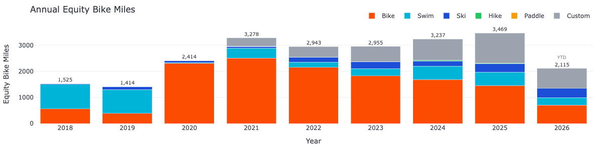
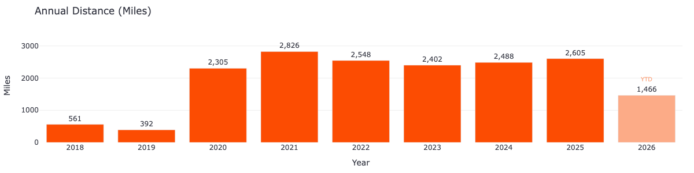
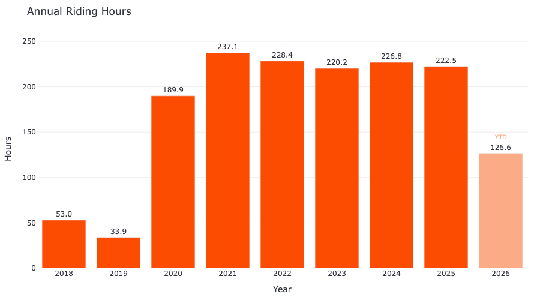
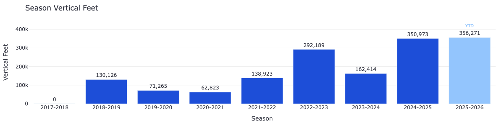
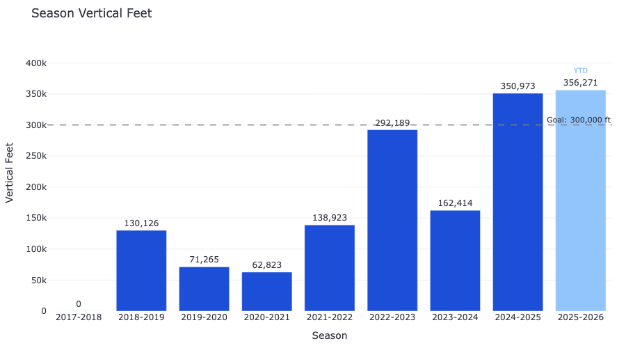
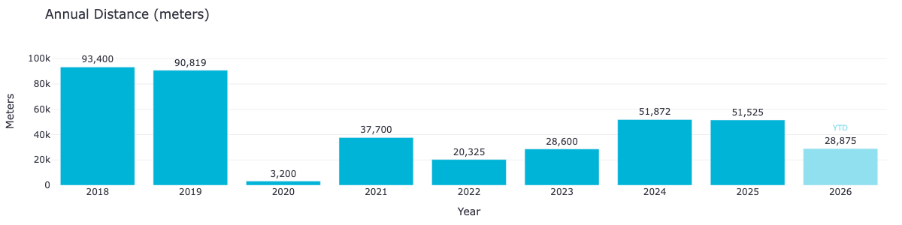

## What is this thing?

Not sure, but I know my Strava 2025 wrapped did not provide many data views I was interested in. I also have strong opinions that "wrapped" packages should not be generated until January 1. Or at least let us paying customers generate a customized one when we want.

A personal Strava activity dashboard — fetches data from the Strava API, archives it locally, and serves an interactive multi-sport analysis via Streamlit.

## Project structure

```
strava-stats/
├── data/
│   ├── raw/                 # Activity archive (JSON, not committed)
│   ├── processed/           # Intermediate outputs
│   ├── images/              # Static PNGs from pipeline (legacy)
│   ├── gear_map.json        # Bike/shoe names (written by pipeline)
│   ├── last_data.json       # Last sync timestamp and count
│   └── settings.json        # User goals and equity conversions
│
├── src/
│   ├── config.py            # Env vars, paths, sport constants, defaults
│   ├── fetch_data.py        # Strava API auth, token refresh, archive sync
│   ├── process_data.py      # Pandas processing and aggregation helpers
│   ├── charts.py            # Plotly figure factories (interactive dashboard)
│   └── publish_data.py      # Matplotlib figure factories (static pipeline)
│
├── docs/screenshots/        # README example images
├── app.py                   # Streamlit interactive dashboard
├── run_pipeline.py          # CLI pipeline: fetch → process → publish
└── requirements.txt
```

## Quick start

```bash
# 1. Install dependencies
pip install -r requirements.txt

# 2. Add credentials to .local.env
echo "STRAVA_CLIENT_ID=your_id" >> .local.env
echo "STRAVA_CLIENT_SECRET=your_secret" >> .local.env

# 3. Sync activities for the first time
python run_pipeline.py

# 4. Launch dashboard
streamlit run app.py
```

After the first pipeline run, use the **Sync Now** button in the sidebar to pull new activities without leaving the browser.

## Dashboard

Eight tabs, each opening with a **thin, full-width annual overview chart** that shows every year at a glance, followed by per-year/season controls and detailed breakdowns.

### Combined

Cross-sport equity miles stacked by year (Bike · Ski · Swim), then a monthly breakdown for the selected year. A compact stats bar shows total equity miles and each sport's share.



### Bike

Annual miles overview (thin), then annual riding hours, followed by a compact stats bar (total distance · longest ride · total hours · total activities). Switch to **Month** or **Week** mode for day-by-day comparison charts: selected period (orange) vs. prior-year same period (blue) vs. current in-progress period (gray).




Gear filter at the bottom lets you isolate rides by specific bike.

### Snow

All-season vertical feet at a glance (thin chart), then a season selector with a stats bar showing days on snow · sessions · total vert · **max single day** · avg vert/day · equity miles. Hover over any season bar to see all three vert metrics in the tooltip.




Below the stats: **Most Recent Snow Activities**, **Biggest Snow Days (All Seasons)**, and a full **Snow Days log** spanning all seasons in reverse chronological order with a Season column.

### Swim

Annual meters overview (thin), then a monthly distance chart for the selected year, a stats bar (total · swims · longest swim · avg per swim · avg per month), and a monthly goal progress bar. Sections follow: **Most Recent Swims**, **Longest Swims**, and a **Swim Equity Events** table listing all SEq activities logged during the swim season (May 7 – Oct 31) with their declared equity miles.



Meters / Yards toggle applies throughout.

### Wrapped

Period × sport summary: pick any rolling window (Last 365 days, Last 30 days, a specific year, or a specific month) and a sport filter (All, Bike, Snow, Swim). Displays annual and monthly distance charts plus a sport-type breakdown.

### Explore

Full-text search across all activities with date-range and sport-type filters. Results table with CSV download.

### Export

Annual sport summaries, per-year monthly breakdowns, and a full activity table — each with a PNG download button and a combined ZIP download.

### Settings

Equity mile conversion rates and annual/monthly/seasonal goals. Changes are written to `data/settings.json` immediately.

## Equity miles

Normalizes cross-sport effort to a common "bike mile" unit:

| Sport | Default conversion |
|---|---|
| Bike | 1 mile = 1 equity mile (reference) |
| Swim | 100 meters = 1 equity mile |
| Ski  | 1,000 vertical feet = 1 equity mile |

Activities whose names contain an equity marker (`SEq`, `HEq`, `GEq`, etc.) are manual equity declarations and are listed for review but **excluded from calculated totals** to avoid double-counting. `SEq` activities are date-classified: swim season (May 7 – Oct 31) → Swim equity; otherwise → Ski equity.

Conversion rates and goals are configurable in the Settings tab and persisted to `data/settings.json`.

## Sidebar sync

The sidebar shows the last sync age and total activity count. Clicking **Sync Now** runs an incremental Strava fetch inside a live progress widget, clears the data cache, and reloads the dashboard automatically.

## Data storage and persistence

All data lives in the `data/` directory and persists between sessions. Nothing is sent to a remote server — everything stays local.

### Activity archive

The primary data store is `data/raw/my_strava_activities.json`, a flat JSON array of every activity ever synced. It grows incrementally:

- **Past years** — fetched once and never re-fetched.
- **Current year** — checked on every sync run; only activities newer than the last archived timestamp are appended.

The archive is not committed to git (listed in `.gitignore`). The dashboard reads it directly on startup via `app.py`'s cached `load_activities()`.

### Supporting files

| File | Written by | Contains |
|---|---|---|
| `data/raw/my_strava_activities.json` | `run_pipeline.py` / Sync | Full activity archive |
| `data/gear_map.json` | `run_pipeline.py` / Sync | Bike ID → name mapping |
| `data/last_data.json` | `run_pipeline.py` / Sync | Last sync timestamp and count |
| `data/athlete_profile.json` | `run_pipeline.py` | Name, location, follower count |
| `data/athlete_stats.json` | `run_pipeline.py` | All-time and YTD Strava totals |
| `data/settings.json` | Settings tab in app | Goals and equity conversion rates |

None of these files are committed to git — they're personal data and are regenerable from the Strava API.

#### `data/strava_tokens.json`

Written on first auth and updated automatically on each token refresh. Never commit this file — it contains your OAuth credentials.

To obtain it, complete the Strava OAuth flow once manually (see [Strava API Getting Started](https://developers.strava.com/docs/getting-started/)). The file structure is:

```json
{
    "access_token": "your_access_token_here",
    "refresh_token": "your_refresh_token_here",
    "expires_at": 1234567890,
    "token_type": "Bearer"
}
```

The pipeline refreshes the access token automatically when it expires (every 6 hours).

#### `data/settings.json`

Created automatically with defaults on first run. Edit via the Settings tab, or manually:

```json
{
  "conversions": {
    "swim_meters_per_mile": 100,
    "ski_vert_per_mile": 1000
  },
  "goals": {
    "annual_equity_miles": 3000,
    "monthly_equity_miles": 250,
    "ski_season_vert_ft": 200000,
    "swim_monthly_meters": 10000
  }
}
```

#### `data/raw/YYYY.json`

Per-year activity files (e.g. `2025.json`, `2026.json`) are the same format as the main archive. The dashboard auto-merges any year files found in `data/raw/` that are not already in the main archive.

### How the dashboard loads data

On startup, `app.py` calls `load_activities()` (decorated with `@st.cache_data`):

1. Reads `data/raw/my_strava_activities.json` as the base archive.
2. Scans `data/raw/` for any per-year files whose year is **not** already in the archive and merges them in.
3. Processes the merged list into a pandas DataFrame via `process_data.process_activities()`.

The result is cached for the lifetime of the Streamlit session.

## Strava activity data

Key fields used from the Strava API:

```json
{
    "name": "Lily dropped me off wander",
    "distance": 26215.8,
    "moving_time": 5587,
    "total_elevation_gain": 141.9,
    "type": "Ride",
    "sport_type": "Ride",
    "start_date_local": "2025-12-31T10:29:50Z",
    "gear_id": "b9657721"
}
```
