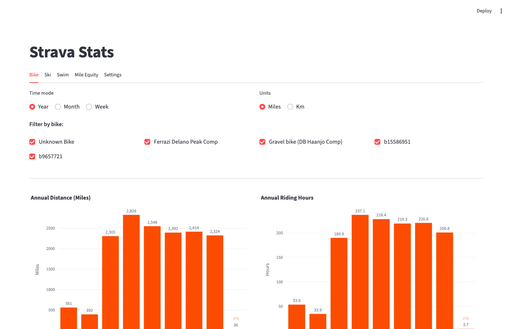
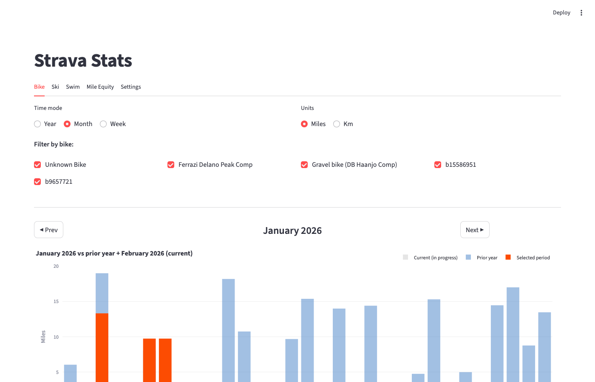
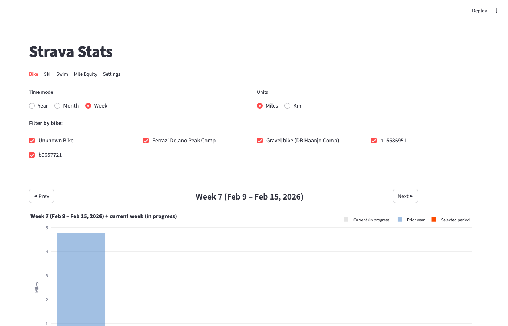
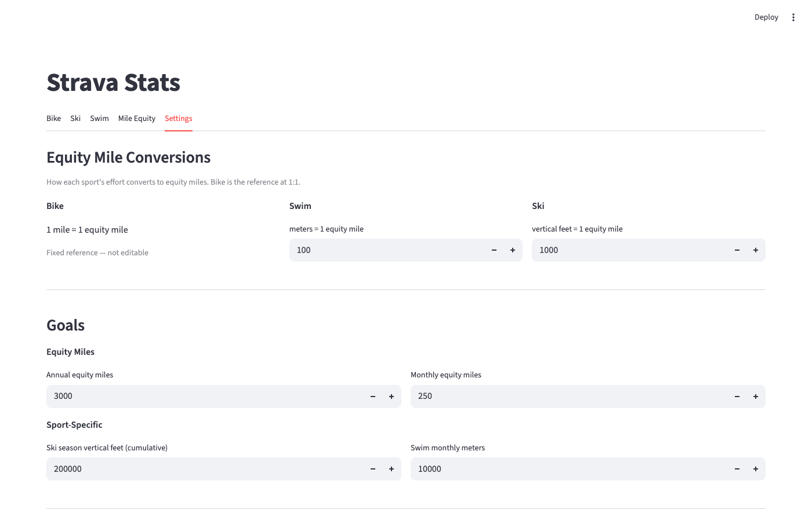

## What is this thing?

Not sure, but I know my Strava 2025 wrapped did not provide many data views I was interested in. I also have strong opinions that "wrapped" packages should not be generated until January 1. Or at least let us paying customers generate a customized one when we want.

A personal Strava activity dashboard — fetches data from the Strava API, archives it locally, and serves an interactive multi-sport analysis via Streamlit.

## Project structure

```
strava-stats/
├── data/
│   ├── raw/                 # Activity archive (JSON, not committed)
│   ├── processed/           # Intermediate outputs
│   ├── images/              # Static PNGs from pipeline
│   ├── gear_map.json        # Bike/shoe names (written by pipeline)
│   └── settings.json        # User goals and equity conversions
│
├── src/
│   ├── config.py            # Env vars, paths, sport constants, defaults
│   ├── fetch_data.py        # Strava API auth, token refresh, archive sync
│   ├── process_data.py      # Pandas processing and aggregation helpers
│   ├── charts.py            # Plotly figure factories (interactive dashboard)
│   └── publish_data.py      # Matplotlib figure factories (static pipeline)
│
├── app.py                   # Streamlit interactive dashboard
├── run_pipeline.py          # CLI pipeline: fetch → process → publish static PNGs
└── requirements.txt
```

## Quick start

```bash
# 1. Install dependencies
pip install -r requirements.txt

# 2. Add credentials to .local.env
echo "STRAVA_CLIENT_ID=your_id" >> .local.env
echo "STRAVA_CLIENT_SECRET=your_secret" >> .local.env

# 3. Sync latest activities and generate gear map
python run_pipeline.py

# 4. Launch dashboard
streamlit run app.py
```

## Dashboard

The interactive dashboard is organized into tabs. The Bike tab is fully implemented; Ski, Swim, Mile Equity, and Settings are in progress.

### Bike — Year view
Annual distance and riding hours, 2018–present. Current year shown in lighter orange (YTD).



### Bike — Month view
Day-by-day comparison: selected month (orange) vs. prior year same month (blue) vs. current month in progress (gray).



### Bike — Week view
ISO week navigator with the same three-period overlay.



### Settings
Equity mile conversion rates (swim meters and ski vertical feet per mile) and annual/monthly/seasonal goals.



## Equity miles

Normalizes cross-sport effort to a common "bike mile" unit:

| Sport | Default conversion |
|---|---|
| Bike | 1 mile = 1 equity mile (reference) |
| Swim | 100 meters = 1 equity mile |
| Ski  | 1,000 vertical feet = 1 equity mile |

Conversion rates and goals are configurable in the Settings tab and persisted to `data/settings.json`.

## Strava activity data

Key fields used from the Strava API:

```json
{
    "name": "Lily dropped me off wander",
    "distance": 26215.8,
    "moving_time": 5587,
    "total_elevation_gain": 141.9,
    "type": "Ride",
    "sport_type": "Ride",
    "start_date": "2025-12-31T17:29:50Z",
    "start_date_local": "2025-12-31T10:29:50Z",
    "timezone": "(GMT-07:00) America/Denver",
    "gear_id": "b9657721",
    "average_watts": 110.9,
    "kilojoules": 619.5
}
```
